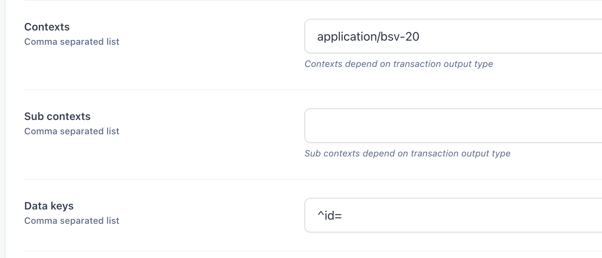

# 1sat-indexer

## Ordinal Indexing
*Not yet functioning.*

Ordinal Indexing is a means of walking back the blockchain to determin a unique serial number (ordinal) assigned to a single satoshi. Details of ordinals can be found here: [https://docs.ordinals.com/]

Indexing Ordinals can be a heavy process without some specialized indexing of the blockchain. These indexes will be built in the near future

## 1Sat Origin Indexing
The BSV blockchain is unique among blockchains which support ordinals, in that BSV supports single satoshi outputs. This allows us to take some short-cuts in indexing until a full ordinal indexer can be built efficiently. 

Since ordinals are a unique serial number for each satoshi, an `origin` can be defined as the first outpoint where a satoshi exists alone, in a one satoshi output. Each subsequent spend of that satoshi will be crawled back only to the first ancestor where the origin has already been identified, or until it's ancestor is an output which contains more than one satoshi.

If a satoshi is subsequently packaged up in an output of more than one satoshi, the origin is no longer carried forward. If the satoshi is later spent into another one satoshi output, a new origin will be created. Both of these origins would be the same ordinal, and when the ordinal indexer is complete, both those origins will be identified as both being the same ordinal.

## Setup instructions depricated.
Please reach out 
## Environment Variables
- POSTGRES_FULL=`<postgres connection string>`
- JUNGLEBUS=https://junglebus.gorillapool.io
- ARC=https://arc.gorillapool.io
- REDIS=`<redis host>:<redis port>`
- TAAL_TOKEN=`<If using TAAL for ARC, provide API Token>`

- copy `.env.example` as `.env`
- go https://junglebus.gorillapool.io to get a subscription id
  
  create a with such config: 
  

## Start docker


```
docker-compose up
```


## Run DB migrations
```

# 
cd migrations
go run .
```
## Run Ord
```
cd cmd/ord
go build
./ord -t [subscription id] -s 825885
```


## Run BSV20v2
```
cd cmd/bsv20v2
go build
./bsv20v2 -t [subscription id] -s 825885
```


## Run Http server
```
cd cmd/server
go build
./server
```
